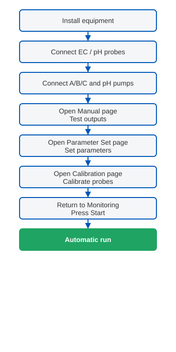
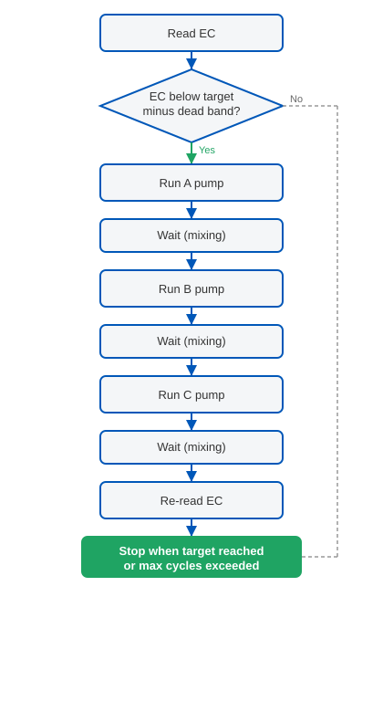
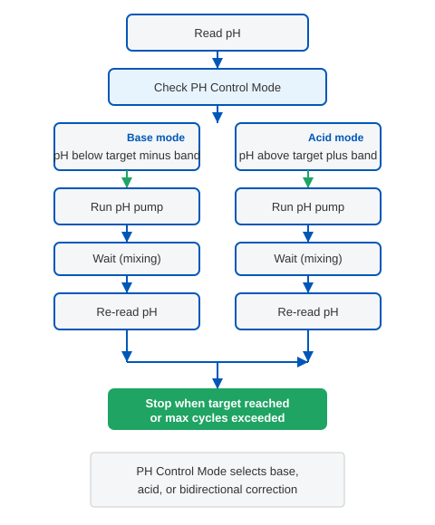

# PKY-ECPH-02 EC/pH Controller Quick Start

This guide helps you install, configure, and start the PKY-ECPH-02 in the shortest time possible. Intended for field operators, greenhouse managers, and distributor technicians.

---

## 1. Product Purpose

The PKY-ECPH-02 is an automatic EC/pH controller for **nutrient mixing tanks**. It continuously monitors EC (electrical conductivity) and pH in the tank and automatically runs the A/B/C fertilizer dosing pumps and pH correction pump to keep nutrient concentration and acidity within your set targets.

Typical applications:

- Hydroponic nutrient preparation
- Greenhouse fertigation mixing stations
- Seedling nutrient solution blending

---

## 2. Pre-Start Checklist

Before powering on, confirm the following:

| Item | Description |
| ---- | ----------- |
| Power | Correct voltage per nameplate; reliable ground connection |
| EC / pH probes | Installed in mixing tank, wired securely, fully submerged |
| A / B / C fertilizer tanks | Adequate level, no leaks, outlet plumbed to mixing tank |
| pH correction fluid | Acid or base tank filled, lines connected correctly |
| Mixing pump | Starts normally; provides adequate tank circulation |
| Inlet solenoid valve | Opens and closes correctly; flow direction correct |
| Mixing tank | Clean, free of debris, outlet unobstructed |

> **Tip:** On first use or after long shutdown, open the **Manual** page and test each pump and valve individually.

---

## 3. Quick Start Flow

Follow this sequence to enter automatic operation:

**Shortest path:** Wire up → Manual test → Parameter Set → Calibration → Monitoring → Start.

---

## 4. Monitoring Screen

Open the **Monitoring** page to view live status:

| UI Element | Description |
| ---------- | ----------- |
| **EC** | Live EC reading (typically mS/cm or EC units) |
| **pH** | Live pH reading |
| **Temperature** | Water temperature from probe; used for compensation |
| **EC Set Value** | EC target setpoint |
| **pH Set Value** | pH target setpoint |
| **Start** | Begin automatic EC/pH control |
| **Stop** | Stop automatic control; all dosing outputs off |
| **Alarm indicator** | Active when EC/pH out of range or probe fault |
| **Output status** | Shows whether A/B/C pumps, pH pump, mixer, and inlet valve are running |

> During automatic operation, stay on this page or allow background operation to monitor values and alarms.

---

## 5. Parameter Set Page

**Parameter Set** is the core configuration screen. All values must be set correctly before automatic run.

### EC Parameters

| Parameter | Summary |
| --------- | ------- |
| **EC Set Value** | EC target. Controller adjusts EC toward this value |
| **EC Safety Range** | EC dead band (hysteresis). Dosing starts only when EC falls below Set Value minus this range |
| **EC Ratio** | Ratio coefficients for A/B/C fertilizer channels |
| **EC AL / EC AH** | EC alarm low and high limits. Out-of-range triggers alarm |
| **EC Max-Number** | Maximum dosing cycles per adjustment loop |
| **EC One-Time** | Run time (seconds) for each dosing pump activation |
| **EC Mixing Time** | Wait time (seconds) after each dose for mixing |
| **EC Alarm Mode** | How EC alarms are signaled (buzzer, display, relay, etc.) |
| **Controller Mode** | Overall mode: Auto / Manual |
| **Temperature** | Temperature compensation setting |
| **Reading Time** | Sensor polling interval (seconds) |

> See [Parameter Guide](./parameter-guide-en.md) for defaults and recommended ranges.

### pH Parameters

| Parameter | Summary |
| --------- | ------- |
| **PH Set Value** | pH target |
| **PH Safety Range** | pH dead band. Correction starts only when pH deviates beyond this range |
| **PH AL / PH AH** | pH alarm low and high limits |
| **PH Max-Number** | Maximum pH correction cycles per run |
| **PH One Time** | Run time (seconds) for each pH pump activation |
| **PH Mixing Time** | Wait time (seconds) after each pH correction |
| **PH Alarm Mode** | How pH alarms are signaled |
| **PH Control Mode** | Base only, acid only, or bidirectional auto correction |

**Setup tips:**

1. Set **EC Set Value** and **PH Set Value** to match your crop recipe.
2. Keep Safety Range reasonable: EC 0.1–0.3, pH 0.1–0.2 to avoid pump chatter.
3. **Mixing Time** should allow full tank homogenization, typically 30–120 seconds.
4. Press **Save** after changes, then return to Monitoring and press Start.

---

## 6. Manual Test

Use the **Manual** page to drive each output individually during commissioning:

| Action | Purpose |
| ------ | ------- |
| Run A / B / C pumps | Verify each fertilizer line flows into the tank |
| Run pH correction pump | Verify acid or base line is clear |
| Run mixing pump | Verify adequate tank circulation |
| Toggle inlet solenoid valve | Verify fill and shut-off |

Run each output for only a few seconds and observe flow and tank level. **Turn off all manual outputs** before switching to automatic mode.

---

## 7. EC / pH Calibration

Enter the **Calibration** page when probes are new or readings are clearly wrong:

**EC calibration (brief):**

1. Immerse EC probe in standard solution (e.g. 1.413 or 12.88 mS/cm).
2. Wait for stable reading; select the matching calibration point and confirm.
3. Perform a second point if higher accuracy is needed.

**pH calibration (brief):**

1. Calibrate with pH 4.0 and pH 7.0 (or pH 7.0 and pH 10.0) buffer solutions in sequence.
2. Rinse probe between solutions; blot dry gently (do not rub the bulb).
3. Complete Low / High point calibration per on-screen prompts.

> Use fresh buffer within expiry. Return to Monitoring after calibration to verify readings.

---

## 8. Start Automatic Operation

After parameters are set, probes calibrated, and Manual test passed:

1. Return to **Monitoring**.
2. Confirm EC Set Value and pH Set Value are correct.
3. Press **Start**.

The controller operates as follows:

**During operation:**

- When EC is low, A → B → C pumps run in sequence; each dose is followed by Mixing Time before re-reading.
- When pH deviates, the pH pump runs per PH Control Mode (acid or base).
- Each loop stops when target is reached or Max-Number limit is hit; then waits for the next Reading Time cycle.

---

## 9. Alarms

The controller logs alarms for EC/pH out of range, probe fault, dosing limit exceeded, etc.:

Open the **Alarm** page to view:

- Alarm type and timestamp
- Active vs cleared alarms
- Alarm history (firmware dependent)

**Common alarms:**

| Alarm | Likely cause | Action |
| ----- | ------------ | ------ |
| EC too high / low | Wrong recipe, dirty probe, empty tank | Check recipe and level; clean or calibrate probe |
| pH too high / low | Correction fluid empty; probe drift | Refill acid/base; recalibrate |
| Dosing limit exceeded | EC Set Value too high; Mixing Time too short | Adjust Set Value or increase Mixing Time |
| Probe fault | Loose wiring; damaged probe | Check wiring; replace probe if needed |

---

## 10. FAQ

**Q: Start pressed but no dosing?**

- Check whether EC is below EC Set Value minus EC Safety Range.
- Confirm Controller Mode is Auto, not Manual.
- Check EC AL / EC AH limits.

**Q: pH never reaches target?**

- Check correction fluid level.
- Confirm PH Control Mode matches installed fluid (acid vs base).
- Increase PH Mixing Time.

**Q: Readings jump around?**

- Verify mixing pump is running and tank is homogeneous.
- Check probe for bubbles or fouling.
- Increase Reading Time to reduce polling frequency.

**Q: EC only, no pH control?**

- Set PH Control Mode to off or manual; EC auto control continues (option name varies by firmware).

**Q: Long-term shutdown?**

- Store probe in storage solution per manual.
- Flush dosing lines to prevent crystallization.

---

## 11. Next Steps

| Document | Content |
| -------- | ------- |
| [Parameter Guide](./parameter-guide-en.md) | Full Parameter Set reference |
| [System Diagram](./system-diagram-en.md) | Equipment layout and workflow |

For project integration or bulk deployment, contact PKYDrip technical support.
