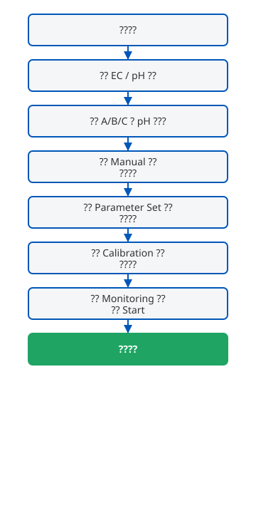
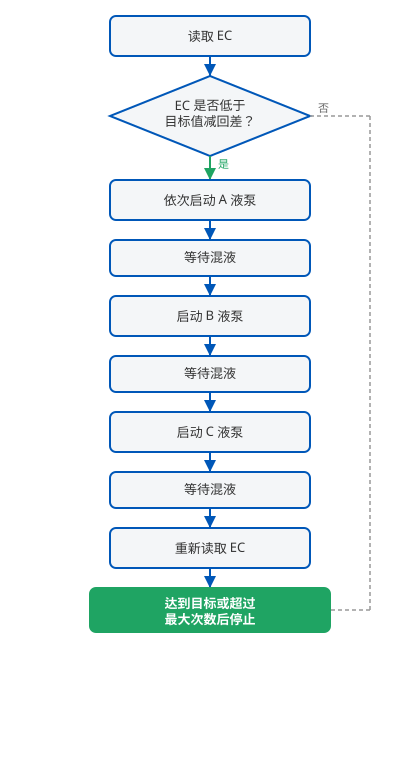
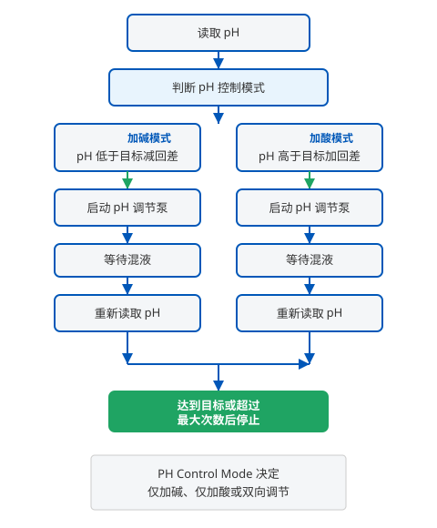

# PKY-ECPH-02 EC/pH 控制器快速入门

本文档帮助您在最短时间内完成 PKY-ECPH-02 的安装、参数设置与自动运行。适合现场操作员、温室管理员及代理商技术人员阅读。

---

## 1. 产品用途

PKY-ECPH-02 是一款用于**营养液混液桶**的 EC/pH 自动调节控制器。它实时监测混液桶中的 EC（电导率）和 pH 值，并根据设定目标自动启动 A/B/C 肥液加药泵及 pH 调节泵，使营养液浓度和酸碱度保持在设定范围内。

典型应用场景：

- 无土栽培营养液配制
- 温室水肥一体化混液站
- 育苗营养液调配

---

## 2. 首次使用前检查

在通电运行前，请确认以下事项：

| 检查项 | 说明 |
| ------ | ---- |
| 电源 | 按设备铭牌接入正确电压，接地可靠 |
| EC / pH 探头 | 已安装于混液桶内，接线牢固，探头浸没于液面以下 |
| A / B / C 肥液桶 | 液位充足，管路无泄漏，泵出口接入混液桶 |
| pH 调节液 | 酸液或碱液桶液位充足，管路正确 |
| 搅拌泵 | 可正常启动，混液桶内液体可充分混合 |
| 进水电磁阀 | 可正常开关，进水方向正确 |
| 混液桶 | 桶体清洁，无杂物，出水口畅通 |

> **提示：** 首次使用或长期停用后，建议先进入 **Manual（手动）** 页面，逐项测试各泵和阀门动作是否正常。

---

## 3. 快速启动流程

按以下顺序操作，即可让设备进入自动运行：

**最短路径：** 接线 → Manual 测试 → Parameter Set 设参 → Calibration 校准 → Monitoring 点 Start。

---

## 4. 主监控界面

进入 **Monitoring（监控）** 页面，可查看实时运行状态：

| 界面元素 | 中文说明 |
| -------- | -------- |
| **EC** | 当前 EC 实时测量值（单位通常为 mS/cm 或 EC 值） |
| **pH** | 当前 pH 实时测量值 |
| **Temperature（温度）** | 探头测得的水温，用于温度补偿 |
| **EC Set Value** | EC 目标设定值，控制器以此为目标调节 |
| **pH Set Value** | pH 目标设定值 |
| **Start** | 启动自动控制，开始 EC/pH 闭环调节 |
| **Stop** | 停止自动控制，所有加药输出关闭 |
| **报警指示** | 出现 EC/pH 超限、探头异常等情况时亮起或闪烁 |
| **输出状态** | 显示 A/B/C 加药泵、pH 泵、搅拌泵、进水阀当前是否动作 |

> 自动运行期间请保持在此页面或允许后台运行，便于随时查看实时数值和报警。

---

## 5. 参数配置页面

**Parameter Set（参数配置）** 是控制器的核心设置页面，运行前必须正确填写。

### EC 参数

| 参数 | 作用简述 |
| ---- | -------- |
| **EC Set Value** | EC 目标值。控制器将 EC 调节到此数值附近 |
| **EC Safety Range** | EC 回差（死区）。EC 低于「目标值 − 回差」时才启动加肥，避免频繁启停 |
| **EC Ratio** | A/B/C 各肥液通道的配比系数，按您的配方设置 |
| **EC AL / EC AH** | EC 报警下限与上限。超出范围触发报警，不自动加肥 |
| **EC Max-Number** | 单次调节循环中，最多允许加肥的次数 |
| **EC One-Time** | 每次启动加药泵的运行时间（秒） |
| **EC Mixing Time** | 每次加肥后等待搅拌混合的时间（秒） |
| **EC Alarm Mode** | EC 报警方式（如声光、仅记录等，视固件版本） |
| **Controller Mode** | 控制器总工作模式（自动 / 手动等） |
| **Temperature** | 温度补偿相关设置 |
| **Reading Time** | 传感器读取间隔（秒） |

> 详细默认值与建议范围请参阅 [参数配置说明](./parameter-guide.md)。

### pH 参数

| 参数 | 作用简述 |
| ---- | -------- |
| **PH Set Value** | pH 目标值 |
| **PH Safety Range** | pH 回差。偏离目标超过回差才启动 pH 调节泵 |
| **PH AL / PH AH** | pH 报警下限与上限 |
| **PH Max-Number** | 单次调节最多允许的 pH 调节次数 |
| **PH One Time** | 每次 pH 泵运行时间（秒） |
| **PH Mixing Time** | 每次 pH 调节后等待混合的时间（秒） |
| **PH Alarm Mode** | pH 报警方式 |
| **PH Control Mode** | pH 控制方向：仅加碱、仅加酸，或双向自动调节 |

**设置建议：**

1. 先设 **EC Set Value** 和 **PH Set Value**，与您的作物配方一致。
2. 回差（Safety Range）不宜过小，建议 EC 0.1–0.3、pH 0.1–0.2，减少泵频繁动作。
3. **Mixing Time** 应足够让桶内液体混合均匀，通常 30–120 秒。
4. 修改参数后按 **Save（保存）** 确认，再返回 Monitoring 启动。

---

## 6. 手动测试

进入 **Manual（手动）** 页面，可单独控制各输出，用于安装调试：

| 操作 | 说明 |
| ---- | ---- |
| 启动 A / B / C 泵 | 确认对应肥液能正常流入混液桶 |
| 启动 pH 调节泵 | 确认酸液或碱液管路畅通 |
| 启动搅拌泵 | 确认混液桶内可充分搅拌 |
| 控制进水电磁阀 | 确认进水、停水动作正常 |

测试时每项输出建议只运行数秒，观察管路和桶内液位变化。**测试完成后关闭所有手动输出**，再进入自动模式。

---

## 7. EC / pH 校准

新装探头或读数明显偏差时，需进入 **Calibration（校准）** 页面：

**EC 校准简要步骤：**

1. 用标准 EC 校准液（如 1.413 mS/cm 或 12.88 mS/cm）浸没 EC 探头。
2. 待读数稳定后，选择对应校准点并确认。
3. 必要时做第二点校准以提高精度。

**pH 校准简要步骤：**

1. 用 pH 4.0 和 pH 7.0（或 pH 7.0 和 pH 10.0）标准缓冲液依次校准。
2. 每次换液后充分冲洗探头，用软纸吸干（勿擦拭球泡）。
3. 按界面提示完成 Low / High 点校准。

> 校准液应在保质期内，温度接近使用环境。校准完成后返回 Monitoring 查看读数是否合理。

---

## 8. 开始自动运行

参数设置完毕、探头已校准、Manual 测试通过后：

1. 返回 **Monitoring** 页面。
2. 确认 EC Set Value、pH Set Value 显示正确。
3. 点击 **Start**。

控制器将按以下逻辑自动工作：

**运行中您会看到：**

- EC 偏低时，依次启动 A → B → C 肥液泵，每次加肥后等待 Mixing Time 再读数。
- pH 偏离目标时，按 PH Control Mode 启动 pH 调节泵（加酸或加碱）。
- 达到目标值或达到 Max-Number 上限后，停止本轮调节，等待下次 Reading Time 周期。

---

## 9. 报警查看

出现 EC/pH 超限、探头断线、加肥次数超限等情况时，控制器会记录报警：

进入 **Alarm（报警）** 页面可查看：

- 报警类型与时间
- 当前是否仍有未消除的报警
- 历史报警记录（视固件版本）

**常见报警处理：**

| 报警 | 可能原因 | 处理 |
| ---- | -------- | ---- |
| EC 过高 / 过低 | 配方错误、探头脏污、肥液桶空 | 检查配方与液位，清洗或校准探头 |
| pH 过高 / 过低 | 调节液用尽、探头需校准 | 补充酸/碱液，重新校准 |
| 加肥次数超限 | 目标 EC 设置过高、Mixing Time 过短 | 调整 EC Set Value 或加大混合时间 |
| 探头异常 | 接线松动、探头损坏 | 检查接线，必要时更换探头 |

---

## 10. 常见问题

**Q：点击 Start 后没有加肥动作？**

- 确认当前 EC 是否已低于「EC Set Value − EC Safety Range」。
- 确认 Controller Mode 为自动模式，非 Manual。
- 检查 EC AL / EC AH 是否限制了调节范围。

**Q：pH 一直调节不到位？**

- 检查 pH 调节液是否用尽。
- 确认 PH Control Mode 与您的调节液类型一致（酸液 / 碱液）。
- 适当增大 PH Mixing Time。

**Q：读数跳动大？**

- 确认搅拌泵工作正常，桶内液体均匀。
- 检查探头是否附着气泡或污物。
- 适当增大 Reading Time，减少读取频率。

**Q：能否只控 EC 不控 pH？**

- 可以。将 PH Control Mode 设为关闭或手动，仅使用 EC 自动调节功能（具体选项名以界面为准）。

**Q：长时间停用如何保养？**

- 探头浸入存贮液或按说明书要求保养。
- 排空加药管路残留，防止结晶堵塞。

---

## 11. 下一步阅读

| 文档 | 内容 |
| ---- | ---- |
| [参数配置说明](./parameter-guide.md) | Parameter Set 全部参数详解与建议值 |
| [系统示意图](./system-diagram.md) | 设备连接关系与工作流程 |

如需项目集成或批量部署支持，请联系 PKYDrip 技术支持。
